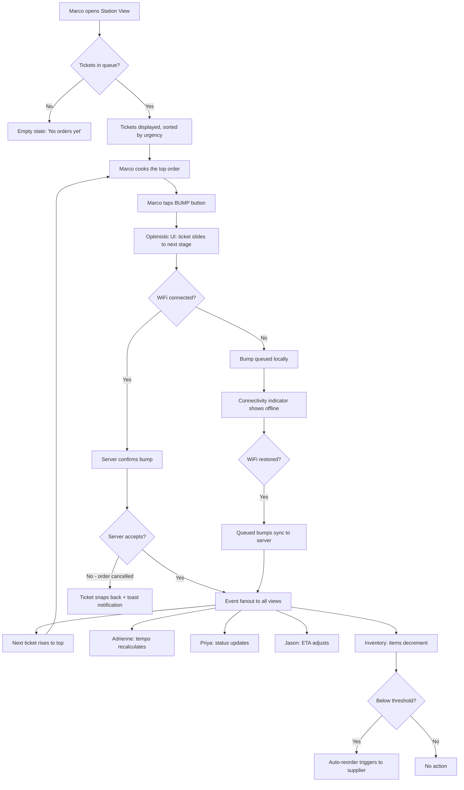
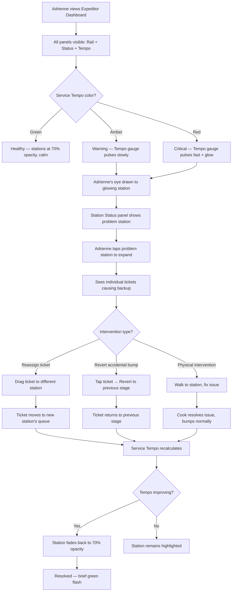
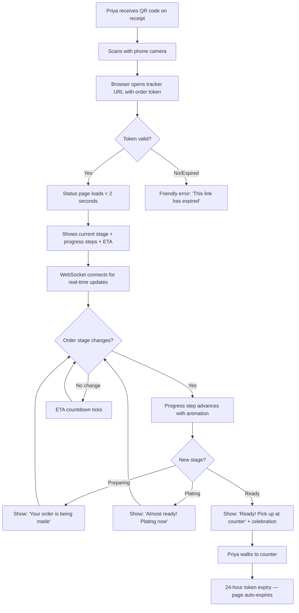
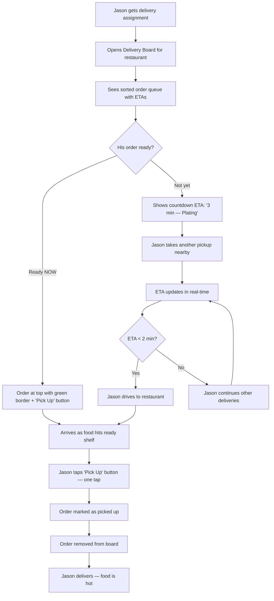
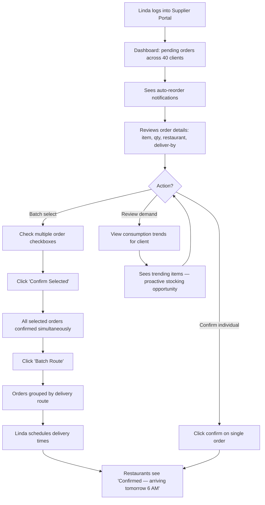
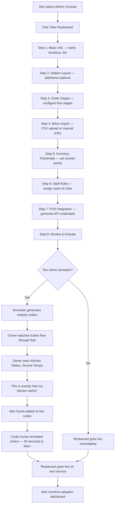

# UX Design Specification — FoodTech

**Author:** TT
**Date:** 2026-03-22

---

## Executive Summary

### Project Vision

FoodTech is a real-time kitchen operations super app that transforms every kitchen event into simultaneous value for all restaurant stakeholders. From a UX perspective, the central design challenge is building a single platform that serves 7 radically different user personas — each operating in different physical environments, on different devices, under different stress levels, with different mental models — while maintaining a coherent design system where one tap from a line cook creates a meaningful experience for everyone in the ecosystem.

The UX philosophy is **progressive complexity**: each persona sees exactly what they need, nothing more. Station View is the simplest professional tool in the kitchen. Expeditor Dashboard is the most powerful. Customer Tracker is the most frictionless. These aren't filtered views of a generic dashboard — they are purpose-built experiences connected by shared real-time data.

### Target Users

| Persona | Context | Primary Device | Core UX Need | Design Priority |
|---------|---------|---------------|-------------|----------------|
| **Marco (Line Cook)** | Hot, noisy kitchen; wet/gloved hands; extreme time pressure during rush | Budget Android tablet (7"-10") | Zero-training interface: see my orders, bump to advance | Large touch targets, high contrast, minimal cognitive load |
| **Adrienne (Head Chef/Expeditor)** | Standing at the pass; sustained multi-station awareness | iPad or wall-mounted TV display | Single-screen operational command center | Attention-driven UI, information density with clarity, real-time alerts |
| **David (Owner/Manager)** | Office, home, or mobile; strategic oversight | Laptop/desktop browser | Drill-down from multi-location overview to station detail | Clear information hierarchy, actionable analytics, comparison views |
| **Priya (Customer)** | Counter, table, or couch; checking phone casually | Personal mobile phone (any) | Instant order status clarity — no friction whatsoever | One-screen design, no login/download, universal device support |
| **Jason (Delivery Partner)** | In car or walking; time-pressured multi-restaurant runs | Mobile phone | Glanceable pickup ETAs and ready-order queue | Scannable layout, real-time countdown, minimal interaction required |
| **Linda (Supplier)** | Office/warehouse desk; managing 40+ restaurant clients | Desktop browser | Multi-client demand overview with batch operations | Dense data tables, bulk actions, clear demand signals |
| **Alex (System Admin)** | Office desk; methodical setup and configuration tasks | Desktop browser | Efficient tenant onboarding and configuration workflows | Wizard-style flows, clear validation, bulk import support |

### Key Design Challenges

1. **Extreme environment diversity** — The platform spans from a greasy budget tablet in a 100°F kitchen with wet-gloved hands to a 65" wall-mounted display viewed from 10 feet away to a clean laptop at a home office. Each environment demands different touch target sizes, contrast ratios, information density, and interaction models. This is not responsive design — it is designing for fundamentally different physical contexts.

2. **Attention-driven UI in high-stress environments** — The "problems glow, healthy operations fade" paradigm must communicate state through peripheral vision in a noisy, chaotic kitchen. The visual language must work without reading — combining color, shape, size, animation, and spatial position to create an instinctive awareness system. This pattern is unproven in commercial kitchen environments.

3. **Seven distinct mental models on one platform** — Each persona conceptualizes the same underlying data differently. A "ticket bump" is "done with this one" for Marco, "tempo shift" for Adrienne, "plating now" for Priya, "ready in 3 min" for Jason, and "inventory decrement" for Linda. Each view must feel purpose-built while sharing a coherent design system.

4. **Zero-friction customer transparency** — The Customer Tracker must deliver instant comprehension to any person on any mobile device via a QR code scan — no app, no login, no tutorial. The entire user journey is one screen viewed for 10-30 seconds at a time. Every pixel must earn its place.

5. **Offline and degraded-state UX** — Kitchen WiFi is unreliable. Station View must handle disconnection gracefully with optimistic UI for bump actions, clear connection-state indicators that don't cause panic, and seamless state sync on reconnection — all without adding cognitive load to a cook in the middle of rush.

6. **Accessibility in hostile conditions** — WCAG 2.1 AA compliance must coexist with kitchen reality: bright overhead lighting, steam, splashes, noise. Color-blind safe indicators (icon + pattern + color), 48x48dp minimum touch targets, and high-contrast modes are design constraints, not afterthoughts.

### Design Opportunities

1. **Progressive disclosure as competitive moat** — No competitor offers views this tailored per persona. Marco's 30-second onboarding ("watch the screen, hit the button") can become the industry's fastest time-to-value. Purpose-built simplicity at each layer is a designable advantage that compounds through word-of-mouth.

2. **Attention-driven UI as a new kitchen interaction paradigm** — If executed well, the "problems glow" pattern becomes an instinctive awareness system: green means flow, amber means watch, red means act. Kitchen staff develop peripheral-vision fluency with the UI — a designable superpower that no traditional KDS offers.

3. **Service Tempo as emotional design** — The heartbeat metaphor (a single-glance health metric for the entire kitchen) can create an emotional relationship between the chef and the system. When Tempo is green, there's calm confidence. When it shifts to amber, there's focused urgency. This is not just a metric — it's a designed feeling.

4. **QR-to-trust pipeline** — Every Customer Tracker scan is a brand touchpoint that converts customer anxiety into trust. The design of this single screen — clean, accurate, real-time — becomes the restaurant's most powerful retention tool. Transparency, designed well, is marketing.

5. **Demo simulator as design showcase** — The built-in simulator creates an opportunity for an interactive "wow moment" during onboarding: realistic orders flow, tickets move, tempo responds, and the prospect sees FoodTech in action before risking a real service. The simulator UX is as important as the product UX.

## Core User Experience

### Defining Experience

**The ONE thing:** The bump. Everything in FoodTech orbits around a single atomic action — a cook taps the bump button on a ticket. That one tap is the heartbeat of the entire system. It advances the order, shifts Service Tempo, updates the customer, recalculates delivery ETAs, decrements inventory, and potentially triggers a supplier reorder. If the bump feels instant, satisfying, and reliable, the entire platform works. If it feels sluggish, uncertain, or fragile, nothing else matters.

**The core loop per persona:**

| Persona | Core Loop | Frequency |
|---------|-----------|-----------|
| **Marco** | See ticket → Cook → Bump → Next ticket | Every 2-5 minutes, all service |
| **Adrienne** | Scan tempo → Spot anomaly → Intervene → Verify resolution | Continuous awareness, acts on exceptions |
| **David** | Check overview → Drill into outlier → Decide → Monitor result | Several times daily |
| **Priya** | Scan QR → Check status → Wait → See "Ready" → Pick up | One session, 5-30 minutes |
| **Jason** | Check ETAs → Route to ready orders → Confirm pickup | Per delivery, dozens per shift |
| **Linda** | Review demand → Batch orders → Confirm → Schedule delivery | Daily batch workflow |
| **Alex** | Create tenant → Configure stations → Run simulator → Monitor adoption | Per onboarding, then periodic |

### Platform Strategy

**Multi-platform, role-driven:**

| Platform | Primary Views | Interaction Model | Key Constraints |
|----------|--------------|-------------------|----------------|
| **Budget Android tablet (7"-10")** | Station View | Touch-only, wet/gloved hands | 2GB RAM, Android 10+, slow WiFi, 48dp+ targets |
| **iPad** | Station View, Expeditor Dashboard | Touch, stylus-optional | Higher capability but same kitchen constraints |
| **Wall-mounted TV (32"-65")** | Expeditor Dashboard, Delivery Board | Display-only, no touch | Auto-scaling, readable from 10+ feet, no interaction |
| **Desktop/laptop browser** | Management Console, Supplier Portal, Admin Console | Mouse/keyboard | Dense information layouts, multi-tab workflows |
| **Mobile phone (any)** | Customer Tracker, Delivery Board | Touch, one-handed | Minimal interaction, glanceable, works on any device/browser |

**Architecture:** Single SPA with role-based routing for restaurant views. Separate SPA for Supplier Portal (different domain, auth, data model). Customer Tracker is a lightweight web page — no SPA overhead.

**Offline strategy:** Station View caches ticket queue locally, supports optimistic bump actions during disconnection, and syncs on reconnect. Other views degrade gracefully with clear "reconnecting..." indicators. No data loss on WiFi drop.

### Effortless Interactions

**Zero-thought actions (must feel automatic):**
- **Bump-to-advance** — One tap, instant visual response, no confirmation dialog, no undo prompt. The ticket moves. Period. Optimistic UI means the cook never waits for the server.
- **QR-to-status** — Scan code, see order status. No page to load-then-redirect, no cookie consent wall, no "enter your email." Status is the first and only thing you see.
- **Attention shift** — Adrienne doesn't "check" stations. Problems come to her — they glow, they grow, they pulse. Healthy operations fade. The UI directs her eyes to what matters without any manual scanning.
- **Auto-reorder** — Inventory drops below threshold, supplier order fires. No manual PO creation, no phone call, no email. Linda sees it in her portal, confirms with one click.

**Steps eliminated vs. competitors:**
- No ticket-by-ticket status entry (bump auto-advances through stages)
- No switching between kitchen and inventory apps (unified view)
- No separate customer notification system (status propagates automatically from bump)
- No delivery partner check-in calls ("How long on order 47?") — they see the answer live
- No manual supplier reorder process — threshold triggers do it

### Critical Success Moments

**Make-or-break moments:**

1. **First bump during a real service** — Marco bumps his first ticket on a live Friday night. If the ticket slides smoothly, the next order appears instantly, and he thinks "that's it?" — we've won. If there's a lag, a spinner, or confusion — we've lost him permanently.

2. **First attention-driven alert** — Adrienne is looking at a green dashboard. One station turns amber and starts glowing. If she notices it in peripheral vision within 5 seconds without anyone telling her — the paradigm works. If she has to actively scan the dashboard to find problems — it's just another screen.

3. **First QR scan** — Priya scans the code. If her order status appears in under 2 seconds with clear, beautiful, obvious meaning — she screenshots it and texts a friend. If there's a loading spinner, a login prompt, or confusing UI — she never scans again.

4. **First auto-reorder confirmation** — Linda opens her Supplier Portal and sees an auto-triggered order waiting for confirmation. If she can confirm with one click and batch it with other orders — FoodTech just replaced 3 phone calls. If the workflow is clunky or unclear — she goes back to voicemail.

5. **First multi-location overview** — David opens his dashboard and sees 3 locations at a glance. If he can spot the underperforming location, drill in, identify the bottleneck, and take action in under 60 seconds — he's hooked. If it takes 5 clicks to get to useful information — he goes back to driving between sites.

**The "aha" moment:** The first Friday rush where the entire kitchen flows without shouting. Marco bumps, Adrienne watches tempo stay green, Priya sees "plating now" on her phone, Jason walks in right as the food hits the shelf, and David watches it all from home. One system, one truth, zero chaos.

### Experience Principles

1. **One tap, many ripples** — Every primary action should require exactly one interaction from the user while creating value for multiple stakeholders simultaneously. No confirmation dialogs on core actions. No multi-step workflows for frequent operations. The system amplifies human intent.

2. **Information finds you** — Users should never hunt for information. Problems glow, orders appear, alerts surface, statuses push. The right information arrives at the right view at the right moment. Passive awareness over active searching.

3. **Complexity is a persona choice, not a toggle** — Marco's view is simple because Marco's job is simple: cook and bump. Adrienne's view is rich because Adrienne's job is complex: manage everything. The system doesn't have a "simple mode" and an "advanced mode" — it has purpose-built views that match each user's actual cognitive needs.

4. **Works in the worst conditions** — Design for the hardest environment first: wet hands, hot kitchen, bad WiFi, cheap tablet, peak rush, maximum stress. If it works there, it works everywhere. Never sacrifice kitchen usability for office elegance.

5. **Transparency creates trust** — Every status shown to a customer, delivery partner, or supplier must be accurate and real-time. Showing "preparing" when the order is actually stuck erodes trust permanently. Better to show "delayed" honestly than "on track" falsely. The system's credibility is its most valuable asset.

## Desired Emotional Response

### Primary Emotional Goals

**Per persona — what they should feel:**

| Persona | Primary Emotion | The Feeling | What They Say |
|---------|----------------|-------------|---------------|
| **Marco (Line Cook)** | **Calm control** | "I've got this." Even during peak rush, the screen gives him confidence that nothing is slipping. The chaos is outside the tablet — inside it, everything is ordered and manageable. | "I don't stress about tickets anymore." |
| **Adrienne (Expeditor)** | **Omniscient confidence** | "I see everything." The dashboard gives her the feeling of having eyes on every station simultaneously. She's not managing chaos — she's conducting an orchestra. | "I see problems before they become fires." |
| **David (Owner)** | **Liberated authority** | "I'm in control without being there." He can trust his kitchens because the system is watching. His energy shifts from firefighting to building. | "I plan menus now, not fix messes." |
| **Priya (Customer)** | **Relaxed trust** | "They've got my order." The anxiety of waiting disappears. She feels respected — the restaurant told her what's happening without her having to ask. | "I knew exactly when to walk up." |
| **Jason (Delivery)** | **Efficient mastery** | "I'm always one step ahead." He arrives right when food is ready. He earns more because he wastes less. He feels like a professional, not a worker waiting in lobbies. | "I never wait at FoodTech restaurants." |
| **Linda (Supplier)** | **Proactive capability** | "I predicted that." She sees demand before it becomes an emergency. She feels like a strategic partner, not a reactive vendor. | "I ship before they call." |

### Emotional Journey Mapping

**Stage-by-stage emotional arc:**

| Stage | Marco | Adrienne | Priya | Jason |
|-------|-------|----------|-------|-------|
| **Discovery/Onboarding** | Skeptical → Surprised ("that's all I do?") | Curious → Impressed ("this shows everything") | Unaware → Intrigued (QR scan) | Indifferent → Interested ("real ETAs?") |
| **First Use** | Cautious → Confident (first bump works perfectly) | Exploring → Trusting (attention UI catches real issue) | Hopeful → Satisfied (status is accurate) | Testing → Convinced (arrives right on time) |
| **Core Loop** | Focused → In flow state (bump rhythm) | Vigilant → Calm (green tempo, problems surface) | Patient → Relieved ("Ready — pick up") | Calculating → Optimizing (routing efficiently) |
| **When Things Go Wrong** | Concerned → Supported (system shows delay clearly) | Alert → Empowered (sees problem, acts fast) | Anxious → Informed (honest "delayed" status) | Frustrated → Adaptive (ETA adjusts, reroutes) |
| **Long-term Return** | Habitual → Can't imagine without it | Dependent → "My command center" | Expectant → "This is how restaurants should work" | Loyal → Prioritizes FoodTech restaurants |

### Micro-Emotions

**Critical micro-emotional states to design for:**

- **Confidence over confusion** — Every element on screen must communicate its meaning without explanation. A cook with 30 seconds of training must feel confident. If there's ever a moment of "what does this mean?" — we've failed.

- **Trust over skepticism** — When the Customer Tracker says "plating now," it must actually be plating now. When the ETA says 3 minutes, it should be 3 minutes (±2). One inaccurate status destroys trust permanently. The system earns trust through relentless accuracy.

- **Flow over interruption** — Marco should never feel pulled out of his cooking rhythm by the UI. The bump action is part of his flow, not an interruption to it. Notifications, alerts, and updates should enhance awareness without demanding attention from the wrong person.

- **Empowerment over overwhelm** — Adrienne sees a lot of information, but it should feel like power, not noise. The attention-driven UI is the key: by dimming what's healthy, the dashboard gets quieter as things go well. Information density increases with problems, not by default.

- **Respect over neglect** — Priya should feel that the restaurant respects her time. The tracker communicates: "We know you're waiting, and here's exactly what's happening." This is the emotional opposite of standing at a counter wondering if you've been forgotten.

### Design Implications

**Emotion-to-design connections:**

| Desired Emotion | Design Approach |
|----------------|-----------------|
| **Calm control** (Marco) | Minimal UI, large bump target, clear ticket queue order, no distracting elements. The screen is a calm island in a chaotic kitchen. |
| **Omniscient confidence** (Adrienne) | Information-dense but hierarchy-driven layout. Attention-driven UI ensures cognitive load scales with problems, not with data volume. Green = quiet. Red = loud. |
| **Relaxed trust** (Priya) | Clean, minimal status page. Progress visualization that feels honest and alive (not static). Micro-animations that signal "this is real-time, not cached." |
| **Efficient mastery** (Jason) | Countdown-style ETAs, sorted ready queue, one-tap pickup confirmation. The board feels like a mission control for deliveries. |
| **Proactive capability** (Linda) | Demand trend visualizations, batch-action affordances, clear auto-reorder indicators. The portal feels like a strategic command center. |
| **Honest transparency** (errors) | When things go wrong, communicate clearly and immediately. Never hide delays behind optimistic statuses. Use amber/yellow to say "we know, we're on it" — this builds more trust than pretending everything is fine. |

### Emotional Design Principles

1. **Calm is the default state** — When everything is working, the UI should feel serene. Green, quiet, flowing. Emotional intensity should only increase when the system needs human attention. A kitchen running smoothly should feel smooth on screen.

2. **Accuracy is the foundation of trust** — No emotional design technique can compensate for inaccurate information. If the status says "ready" and it isn't, no amount of beautiful animation fixes the betrayal. Earn trust through precision first, then design for delight.

3. **Respect every user's time and context** — Marco has 3 seconds to glance at his screen. Priya checks her phone for 5 seconds. Jason looks while walking. Every pixel must respect the user's available attention. Never waste attention on decoration when information is needed.

4. **Celebrate flow, surface friction** — The emotional design should make smooth operations feel good (green glow, steady tempo) and make problems feel urgent but solvable (amber pulse, clear cause). The system should never make problems feel catastrophic — always actionable.

5. **The best feeling is not noticing the tool** — Marco's peak emotional state isn't "I love this app." It's "I just cooked a perfect service and didn't think about the technology once." The UI succeeds when it disappears into the workflow.

## UX Pattern Analysis & Inspiration

### Inspiring Products Analysis

**1. Datadog / Grafana — Observability Dashboards**

| Aspect | What They Do Well | FoodTech Application |
|--------|------------------|---------------------|
| **Core problem solved** | Make complex distributed systems observable at a glance | Make complex kitchen operations observable at a glance |
| **Attention management** | Alerts surface problems while healthy metrics fade into background. Color-coded severity (green/yellow/red/critical) with progressive escalation | Direct inspiration for attention-driven UI: healthy stations dim, problem stations glow. Service Tempo mirrors a system health dashboard |
| **Information density** | Dense data without overwhelm — achieved through hierarchy, sparklines, and summary-then-drill-down patterns | Expeditor Dashboard needs this exact pattern: summary state per station → drill into specific tickets |
| **Real-time updates** | Live-updating metrics feel alive without being distracting. Subtle animations signal freshness without demanding attention | All FoodTech views need this "alive but calm" quality — updates flow in without jarring the user |

**2. Trello / Linear — Kanban Task Management**

| Aspect | What They Do Well | FoodTech Application |
|--------|------------------|---------------------|
| **Core problem solved** | Visualize work items flowing through stages | Order tickets flowing through kitchen stages (received → preparing → plating → served) |
| **Drag/bump interaction** | Cards move between columns with satisfying animations. State change is instant and visual | The Rail's bump-to-advance interaction — ticket slides to next stage with tactile feedback |
| **Progressive detail** | Card shows summary in list; click to expand full detail. Information hierarchy prevents overwhelm | Ticket cards show key info (order #, items, time) at glance; tap to expand for full details |
| **Column-based flow** | Left-to-right progression creates natural visual metaphor for work moving forward | Kanban columns map directly to kitchen stages — the spatial metaphor is intuitive |

**3. Domino's Pizza Tracker — Customer Order Transparency**

| Aspect | What They Do Well | FoodTech Application |
|--------|------------------|---------------------|
| **Core problem solved** | Eliminate "where's my food?" anxiety with real-time visibility | Exact same problem — FoodTech's Customer Tracker for any restaurant |
| **Simplicity** | One screen, linear progress, no decisions required. You look, you see, you wait | Customer Tracker must be this simple — status, progress bar, ETA. Nothing else |
| **Emotional design** | Progress bar creates anticipation, not anxiety. Each stage transition feels like forward motion | Stage transitions should feel satisfying — "Preparing → Plating" is a moment of relief |
| **No friction** | No app download, no account creation for basic tracking | FoodTech's QR-to-status must match this zero-friction model |

**4. Uber Driver App — Real-Time Gig Worker Optimization**

| Aspect | What They Do Well | FoodTech Application |
|--------|------------------|---------------------|
| **Core problem solved** | Optimize driver routing and earnings with real-time demand signals | Jason (delivery partner) optimizing pickups with real-time kitchen ETAs |
| **Glanceable interface** | Large text, high contrast, designed for quick looks while driving | Delivery Board must be equally glanceable — large ETAs, clear ready indicators |
| **Time-based urgency** | Countdown timers, surge indicators, time-sensitive acceptance windows | Pickup ETA countdowns, ready-order alerts create productive urgency |
| **One-tap actions** | Accept ride, navigate, confirm — each is a single tap with no confirmation | Confirm pickup should be one tap, matching the bump-to-advance pattern |

**5. Square POS — Restaurant-Grade Touch Interfaces**

| Aspect | What They Do Well | FoodTech Application |
|--------|------------------|---------------------|
| **Core problem solved** | Make tablet-based POS usable by non-technical restaurant staff | Station View must be usable by non-technical line cooks on tablets |
| **Touch optimization** | Large buttons, generous spacing, designed for speed and accuracy under pressure | 48dp+ touch targets, generous padding, no small interactive elements |
| **Error forgiveness** | Easy undo, clear confirmations for destructive actions, forgiving of taps | Bump is intentionally non-undoable (speed > safety), but 86 actions need confirmation |
| **Training-free design** | New staff productive within minutes. Visual metaphors match physical actions | Station View's "watch the screen, hit the button" must achieve the same instant productivity |

### Transferable UX Patterns

**Navigation Patterns:**

- **Role-based routing** (from enterprise SaaS) — Same app, different entry points. Marco logs in and sees Station View. Adrienne logs in and sees Expeditor Dashboard. No menu navigation to find "your" view.
- **Summary → Drill-down** (from Datadog/Grafana) — David sees all locations at a glance, taps one to drill into stations, taps a station to see individual tickets. Three levels, each one tap deep.
- **Kanban columns** (from Trello/Linear) — The Rail's order stages are spatial columns. Left-to-right progression is universal and requires zero explanation.

**Interaction Patterns:**

- **Bump-to-advance** (adapted from POS bump bars) — One-tap stage progression with optimistic UI. Inspired by physical bump bars but enhanced with visual feedback (ticket slides, next order appears, counter updates).
- **Attention-driven glow** (from observability dashboards) — Problems increase visual prominence (size, brightness, pulse). Healthy items decrease. The user's eye is drawn to what needs action without any scanning.
- **Countdown ETAs** (from Uber/ride-share) — Live countdown timers for delivery pickup times. The number counts down in real-time, creating urgency and accuracy simultaneously.
- **Progressive disclosure per role** (from Slack) — Like how Slack shows simple messaging to casual users but exposes workflows, integrations, and admin tools to power users — FoodTech shows different complexity levels to different roles.

**Visual Patterns:**

- **Traffic light status** (universal) — Green/yellow/red is instantly understood worldwide. Combined with icons (checkmark/warning/alert) for color-blind accessibility.
- **Sparkline trends** (from financial dashboards) — Small inline graphs showing Service Tempo trend over time. No labels needed — the shape tells the story.
- **Pulse animation for urgency** (from notification systems) — Slow pulse for amber warnings, faster pulse for red alerts. Animation speed communicates severity without text.

### Anti-Patterns to Avoid

| Anti-Pattern | Why It Fails | FoodTech Risk Area |
|-------------|-------------|-------------------|
| **Dashboard overload** — showing everything equally | Creates cognitive overload, nothing stands out, users stop looking | Expeditor Dashboard must NOT show all stations at equal prominence. Attention-driven UI is the antidote. |
| **Confirmation dialog addiction** — "Are you sure?" on every action | Destroys flow state, slows down time-critical operations, treats users as error-prone | Bump-to-advance must NEVER show a confirmation. Speed is essential. If a cook has to confirm every bump during rush, the system is slower than paper. |
| **Feature hamburger** — hiding important features behind menus | Users don't discover features, navigation adds friction to frequent actions | Station View must have zero hamburger menus. The bump button and ticket queue are always visible, always primary. |
| **Notification bombardment** — alerting on everything | Alert fatigue causes users to ignore all notifications, including critical ones | Only alert on state changes that require action. A bump event is not an alert — it's normal flow. A Service Tempo red-zone IS an alert. |
| **Optimistic lies** — showing "on track" when things are delayed | Destroys trust permanently when reality doesn't match the display | Customer Tracker and Delivery Board must NEVER show false-positive statuses. If an order is stuck, say "delayed" — honesty builds more trust than optimism. |
| **Mobile-shrunk desktop** — responsive design that just scales down | Tiny targets, unreadable text, unusable on actual mobile devices | Station View is tablet-first, not desktop-shrunk. Customer Tracker is mobile-first. Each view is designed for its primary device. |
| **Login walls for casual users** — requiring accounts for one-time interactions | Massive drop-off, especially for customers who just want to check order status | Customer Tracker uses token-based auth (24-hour expiry). No login, no account, no friction. |

### Design Inspiration Strategy

**What to Adopt:**

- **Observability dashboard attention model** (Datadog/Grafana) → Expeditor Dashboard: problems glow, healthy fades. This is a direct pattern transfer.
- **Kanban column flow** (Trello/Linear) → The Rail: orders flow left-to-right through stages. Universal metaphor, zero training.
- **Zero-friction tracking** (Domino's) → Customer Tracker: one screen, linear progress, no decisions. Scan QR, see status, done.
- **One-tap gig worker actions** (Uber) → Delivery Board: confirm pickup with one tap. Countdown ETAs. Glanceable layout.
- **Restaurant-grade touch design** (Square POS) → Station View: large targets, generous spacing, forgiveness built in, zero training.

**What to Adapt:**

- **Observability sparklines** → Adapt for Service Tempo: show trend direction (improving/worsening) without full chart complexity. Kitchen users need direction, not data.
- **Kanban drag-and-drop** → Replace with bump button. Drag-and-drop doesn't work with wet/gloved hands on a tablet. One tap replaces one drag.
- **Uber's surge visualization** → Adapt for kitchen rush: instead of pricing heat maps, use station load indicators that change color intensity based on ticket volume.

**What to Avoid:**

- **Slack's configurability depth** → FoodTech views should be opinionated, not configurable at the UI level. Marco doesn't need to customize his Station View. Configuration happens at admin level, not user level.
- **Trello's card detail expansion in-place** → Don't open ticket details in a modal or expanded card during rush. Information should be visible at the card level. If a cook needs to tap a ticket to see its items, the card design is wrong.
- **Dashboard widget rearrangement** → The Expeditor Dashboard layout should be fixed and optimized. Dragging widgets around is an anti-pattern in high-stress environments — the layout must be instantly familiar every time.

## Design System Foundation

### Design System Choice

**Tailwind CSS + Headless Component Library (Radix UI primitives)**

A utility-first CSS framework paired with unstyled, accessible component primitives. This combination provides maximum visual control with built-in accessibility, minimal bundle size, and rapid development speed — ideal for a solo developer building highly customized, multi-platform kitchen interfaces.

### Rationale for Selection

| Factor | Requirement | Tailwind + Radix Fit |
|--------|------------|---------------------|
| **Bundle size** | Station View < 500KB gzipped | Tailwind purges unused CSS; Radix ships zero styles. Minimal footprint. |
| **Visual control** | Attention-driven UI (glow, fade, pulse), kitchen-grade contrast, traffic-light system | Full control — no fighting component library opinions. Custom animations via Tailwind + CSS variables. |
| **Accessibility** | WCAG 2.1 AA non-negotiable | Radix handles ARIA, focus management, keyboard navigation, screen reader support out of the box. |
| **Multi-platform** | 7" budget tablet → 65" TV | Tailwind responsive utilities + custom breakpoints for kitchen/office/mobile contexts. |
| **Development speed** | Solo developer, greenfield | No component API learning curve. Utility classes are immediately productive. Copy-paste-modify workflow. |
| **Customization depth** | 7 purpose-built views, each with unique interaction patterns | Headless components = full styling freedom. Each view gets exactly the visual treatment it needs. |
| **Maintenance** | Long-term solo maintainability | Utility classes are self-documenting. No dependency on component library release cycles for visual changes. |

**Alternatives evaluated and rejected:**
- **MUI (Material Design):** Too opinionated for attention-driven UI; Material's elevation system conflicts with glow/fade paradigm; Google aesthetic doesn't fit kitchen context.
- **Ant Design:** Bundle too heavy for Station View budget; desktop-first philosophy conflicts with tablet-first kitchen views.
- **Chakra UI:** Good accessibility but unnecessary abstraction layer; component overhead without proportional payoff for FoodTech's limited component variety.
- **Full custom:** Unsustainable for solo developer; accessibility primitives would need to be rebuilt from scratch.

### Implementation Approach

**Design Token Architecture:**

```
tokens/
├── colors.css          — Traffic light system, attention states, brand palette
├── spacing.css         — Kitchen-scale spacing (generous) vs. office-scale (dense)
├── typography.css      — Kitchen-readable sizes, responsive scaling
├── animation.css       — Glow, pulse, fade, slide transitions
├── breakpoints.css     — Tablet (7"-10"), iPad, desktop, TV (32"-65")
└── shadows.css         — Minimal — kitchen screens don't need depth illusion
```

**Component Strategy:**

| Component Type | Approach | Examples |
|---------------|----------|---------|
| **Interactive primitives** | Radix UI | Dialogs, dropdowns, toggle switches, tabs, tooltips |
| **Kitchen-specific** | Custom built with Tailwind | Bump button, ticket card, Service Tempo gauge, station status indicator, 86 badge |
| **Layout patterns** | Tailwind utilities | Kanban columns, responsive grids, TV auto-scale layout |
| **Data display** | Custom built with Tailwind | Order timeline, inventory table, demand sparklines, countdown ETAs |
| **Form elements** | Radix UI + Tailwind styling | Admin console forms, configuration wizards, search/filter |

**View-Specific Tailoring:**

| View | Token Set | Component Set | Optimization |
|------|-----------|--------------|-------------|
| **Station View** | Kitchen tokens (large spacing, high contrast, large type) | Ticket card, bump button, 86 badge | < 500KB bundle, offline cache, touch-optimized |
| **Expeditor Dashboard** | Kitchen tokens + dense info tokens | All station components + Service Tempo, attention-driven wrappers | TV-responsive, auto-scaling, display-only mode |
| **Customer Tracker** | Mobile tokens (clean, minimal, branded) | Progress bar, status label, ETA display | Lightest possible bundle, instant load, no framework overhead |
| **Delivery Board** | Mobile tokens + countdown tokens | Ready queue, ETA countdown, pickup confirmation | Glanceable, real-time updates, one-tap actions |
| **Supplier Portal** | Office tokens (dense, productive) | Data tables, batch action bars, demand charts, order cards | Desktop-optimized, keyboard shortcuts, bulk operations |
| **Admin Console** | Office tokens (clean, systematic) | Forms, wizards, data tables, configuration panels | Desktop-only, wizard flows, validation feedback |
| **Management Console** | Office tokens + drill-down tokens | Location cards, comparison charts, drill-down panels | Responsive (laptop + mobile), summary → detail |

### Customization Strategy

**Design Tokens as the Customization Layer:**

Rather than theming components, FoodTech uses CSS custom properties (design tokens) that adapt per context:

- **`--ft-target-size`**: `48dp` in kitchen views, `36dp` in office views, `44dp` in mobile views
- **`--ft-contrast-mode`**: `high` in kitchen (bright lighting), `normal` in office, `auto` in mobile (respects system preference)
- **`--ft-info-density`**: `sparse` in Station View (one ticket fills the card), `dense` in Expeditor Dashboard (multiple stations on screen), `compact` in Supplier Portal (data tables)
- **`--ft-animation-speed`**: `normal` by default, `0` when `prefers-reduced-motion` is active
- **`--ft-status-green/yellow/red`**: Color values paired with `--ft-status-icon-green/yellow/red` (icon) and `--ft-status-pattern-green/yellow/red` (pattern) for color-blind safety

**Attention-Driven UI as a Token System:**

The attention-driven UI (problems glow, healthy fades) is implemented through CSS custom properties that adjust based on entity state:

- **Healthy state**: `opacity: 0.7`, `scale: 1.0`, no animation — fades into background
- **Warning state**: `opacity: 1.0`, `scale: 1.02`, slow pulse animation (2s cycle) — draws peripheral attention
- **Critical state**: `opacity: 1.0`, `scale: 1.05`, fast pulse animation (1s cycle), border glow — demands immediate attention
- **Resolved state**: Brief green flash → return to healthy state — confirms resolution

## Defining Core Experience

### Defining Experience

**FoodTech's defining experience in one sentence:**

> "Bump once, and the whole restaurant knows."

The bump is FoodTech's atomic interaction — one tap from a cook that ripples value to every stakeholder simultaneously. When Marco taps the bump button:
- His ticket slides to the next stage (he sees it move)
- The next order rises to the top (he sees his new work)
- Adrienne's Service Tempo recalculates (she sees flow)
- Priya's tracker updates to "Plating" (she sees progress)
- Jason's ETA counts down (he sees "ready in 2 min")
- Inventory decrements (the system knows stock levels)
- If threshold is hit, supplier order fires (Linda sees demand)

**One tap. Seven ripples. Zero effort from Marco.**

Marco doesn't know or care about any of this. He just bumped a ticket. But that single gesture is the atomic unit of the entire platform. Every feature in FoodTech either produces bumps (order ingestion), consumes bumps (status views), or is influenced by bump patterns (Service Tempo, analytics, inventory).

### User Mental Model

**How each persona conceptualizes the system:**

| Persona | Mental Model | They Think Of It As... | Design Implication |
|---------|-------------|----------------------|-------------------|
| **Marco** | Physical bump bar (digital version) | "A screen that shows my tickets. I hit the button when I'm done." | Must feel as simple as a physical bump bar. Zero learning curve. |
| **Adrienne** | Air traffic control radar | "I can see everything at once and spot problems from across the room." | Dashboard must support peripheral awareness. Anomalies must be visible without focusing. |
| **David** | Business dashboard (like Stripe or Shopify) | "I check my restaurants like I check my bank account." | Summary → detail drill-down. Numbers, trends, comparisons. |
| **Priya** | Package tracking (like Amazon or FedEx) | "I'm tracking my food like I track a delivery." | Linear progress, clear stages, estimated time. Familiar pattern. |
| **Jason** | Dispatch board (like Uber driver app) | "It tells me where to go and when the food is ready." | Countdown timers, sorted queue, one-tap confirm. Action-oriented. |
| **Linda** | Order management system (like Shopify admin) | "I see all my clients' orders in one place and batch my work." | Tables, filters, batch actions. Productivity-oriented. |

**Current workarounds being replaced:**

| Current Workaround | Why It Fails | FoodTech Replacement |
|-------------------|-------------|---------------------|
| Paper tickets on a rail | Get lost, get greasy, can't be read from across the kitchen, no feedback loop | Digital rail with bump-to-advance |
| Shouting across the line ("How long on 47?!") | Disrupts cooking, unreliable, doesn't scale past 4 stations | Service Tempo + station status visible on screen |
| Walking to the 86 board | Takes cook off station, info is already stale by the time they check | 86'd items visible inline on Station View in real-time |
| Calling the kitchen ("Is my order ready?") | Interrupts kitchen staff, customer gets unreliable answer | Customer Tracker shows real-time status automatically |
| Calling the restaurant ("I'm 5 minutes out, is it ready?") | Takes staff off other tasks, answer is a guess | Delivery Board shows accurate ETA from live kitchen state |
| Voicemail/email for supplier orders | Delayed, error-prone, creates emergency orders | Auto-triggered orders when inventory hits threshold |

### Success Criteria

**The bump interaction succeeds when:**

| Criterion | Metric | How We Know It Works |
|-----------|--------|---------------------|
| **Instant response** | < 100ms visual feedback | Ticket visually moves before the server even confirms. Optimistic UI. |
| **Zero confusion** | 0 training time for bump action | New cook watches one bump, does the next one correctly. No explanation needed. |
| **Satisfying feedback** | Qualitative — "that felt good" | Smooth slide animation, subtle sound (optional), clear visual confirmation. The bump should feel like a satisfying click. |
| **Reliable propagation** | < 500ms all-views-updated | Adrienne sees tempo shift, Priya sees status change, Jason sees ETA update — all within half a second of Marco's tap. |
| **Offline resilience** | 0 lost bumps during WiFi drops | Bump works locally via optimistic UI. Syncs when reconnected. Marco never knows WiFi dropped. |
| **No false bumps** | < 1% accidental bump rate | Touch target is large (48dp+) but positioned to avoid accidental activation from adjacent interactions. |
| **Recoverable mistakes** | Expeditor can revert a bump | If Marco bumps accidentally, Adrienne can move the ticket back. Marco can't — speed over safety for the cook. |

### Novel UX Patterns

**Pattern classification for FoodTech's key interactions:**

| Interaction | Classification | Approach |
|------------|---------------|----------|
| **Bump-to-advance** | Established (adapted) | Digital version of physical bump bars used in kitchens for decades. Users already have the mental model. Innovation: one bump triggers multi-view updates. |
| **Attention-driven UI** | Novel (kitchen context) | Borrowed from observability dashboards but untested in physical kitchen environments. Requires validation through pilot testing. Innovation: problems glow, healthy fades — in a kitchen. |
| **Service Tempo** | Novel | No kitchen tool offers a single-metric heartbeat for overall kitchen health. Requires careful calibration — the metric must feel accurate intuitively, not just mathematically. |
| **QR-to-status** | Established | Domino's proved this works. FoodTech's innovation is making it available to any restaurant, not just chains. Execution quality is the differentiator, not the pattern. |
| **Multi-stakeholder event fanout** | Novel (user-facing) | Users don't see the architecture, but they experience it. The novelty is that one cook's bump creates value for 6 other personas simultaneously. No education needed — each persona just sees "their" update. |

**How we teach the novel patterns:**

- **Attention-driven UI**: No explicit teaching. The first time a station turns amber and glows during service, Adrienne's eye is drawn to it. If it works, it teaches itself. If it doesn't work within 5 seconds of peripheral attention, the pattern needs revision.
- **Service Tempo**: Show the gauge on the Expeditor Dashboard from day one. Include a tooltip on first view: "Kitchen health — green means flowing, yellow means watch, red means act." After that, the gauge teaches itself through use.
- **Demo simulator**: The simulator is the teaching tool. Before a real service, staff see the full system working with realistic orders. They learn patterns by watching, then doing — not by reading docs.

### Experience Mechanics

**The Bump — Step-by-Step Flow:**

**1. Initiation — Order Appears**
- POS sends order via API (or staff enters manually)
- System routes items to appropriate stations
- Marco's Station View shows new ticket at bottom of queue
- Ticket slides in with subtle entrance animation
- Visual indicator: new ticket has a brief highlight (0.5s) then settles into the queue

**2. Interaction — Cook Works, Then Bumps**
- Marco cooks the order (FoodTech does nothing during this phase — it waits)
- When done, Marco taps the bump button on the ticket card
- Bump target: full-width button at bottom of ticket card, minimum 48dp height, high-contrast color
- Touch feedback: immediate haptic (if supported) + visual press state (button darkens 50ms)

**3. Feedback — Ticket Moves**
- Ticket slides right/up to next stage with smooth animation (200ms ease-out)
- Next ticket in queue moves up to fill the gap
- Stage counter updates (e.g., "Preparing: 4 → 3")
- If this was the last item in an order, a completion indicator appears briefly
- All of this happens optimistically — before server confirmation

**4. Propagation — Ripple Effect (invisible to Marco)**
- Server receives bump event (< 100ms after tap)
- Event fanout triggers parallel updates:
  - Expeditor Dashboard: ticket position updates, Service Tempo recalculates
  - Customer Tracker: status changes (e.g., "Preparing → Plating")
  - Delivery Board: ETA recalculates
  - Inventory: items decrement
  - If threshold hit: supplier auto-reorder triggers
- All consuming views update within 500ms

**5. Completion — Order Served**
- Final bump moves ticket to "Served" stage
- Ticket fades out of Station View (300ms fade)
- Customer Tracker shows "Ready — pickup at counter"
- Delivery Board moves order to "Ready" queue
- Order enters historical data for analytics

**6. Error States:**
- **WiFi drops during bump**: Bump succeeds locally (optimistic UI). Ticket moves on screen. Queued for sync. Small connectivity indicator shows offline state — does not block any action.
- **Accidental bump**: Expeditor can revert ticket to previous stage from their dashboard. Marco cannot revert — this is intentional (speed over safety for cooks; correction is the expeditor's job).
- **Server rejects bump** (rare — e.g., order was cancelled): Ticket snaps back to previous stage with amber flash. Toast notification: "Order #47 was cancelled." Clear, non-blocking, informative.

## Visual Design Foundation

### Color System

**Design driver:** FoodTech's color system serves two masters — the **traffic light status system** (green/yellow/red) that must be instantly legible in kitchen environments, and the **attention-driven UI** where color intensity communicates urgency. Colors are functional first, branded second.

**Core Palette:**

| Role | Color | Hex | Usage | WCAG Notes |
|------|-------|-----|-------|-----------|
| **Background (Dark)** | Charcoal | `#1A1D23` | Kitchen views — dark backgrounds reduce glare under bright kitchen lighting | Base for high-contrast mode |
| **Background (Light)** | Cool White | `#F8F9FB` | Office views (Supplier Portal, Admin Console, Management Console) | Standard light theme |
| **Surface** | Dark Slate | `#252830` (dark) / `#FFFFFF` (light) | Cards, panels, elevated surfaces | Sufficient contrast in both modes |
| **Primary Brand** | Electric Blue | `#3B82F6` | Interactive elements, links, active states, brand identity | 4.5:1 on dark, 4.6:1 on light |
| **Primary Hover** | Bright Blue | `#60A5FA` | Hover/focus states | Higher luminance for visibility |
| **Text Primary** | Pure White / Near Black | `#FFFFFF` / `#111827` | Main text per theme | 15.4:1 / 14.8:1 — exceeds AAA |
| **Text Secondary** | Light Gray / Medium Gray | `#9CA3AF` / `#6B7280` | Supporting text, labels, timestamps | Meets AA for large text |

**Status Colors (Traffic Light System):**

| Status | Color | Hex | Icon | Pattern | Usage |
|--------|-------|-----|------|---------|-------|
| **Healthy / Green** | Emerald | `#10B981` | Checkmark (✓) | Solid fill | Station ready, order on track, inventory sufficient |
| **Warning / Yellow** | Amber | `#F59E0B` | Warning triangle (⚠) | Diagonal stripes | Ticket aging, inventory low, tempo shifting |
| **Critical / Red** | Rose | `#EF4444` | Alert circle (!) | Cross-hatch | Station backed up, item 86'd, tempo critical |
| **Info / Blue** | Sky | `#3B82F6` | Info circle (i) | Dotted border | New order received, status update, informational |
| **Neutral** | Slate | `#64748B` | Dash (—) | No pattern | Inactive, completed, archived |

**Triple-encoding for color-blind safety:** Every status is communicated through color + icon + pattern simultaneously. A fully color-blind user can distinguish states by icon shape and fill pattern alone.

**Attention-Driven Color States:**

| State | Opacity | Glow | Animation | Visual Weight |
|-------|---------|------|-----------|--------------|
| **Healthy** | 0.7 | None | None | Recedes — peripheral |
| **Watching** | 0.85 | Subtle warm border | None | Noticeable — secondary attention |
| **Warning** | 1.0 | Amber border glow (`0 0 12px #F59E0B40`) | Slow pulse (2s) | Prominent — draws eye |
| **Critical** | 1.0 | Red border glow (`0 0 20px #EF444460`) | Fast pulse (1s) | Dominant — demands action |

### Typography System

**Design driver:** Kitchen screens are read from 2-4 feet away, often at a glance. Office screens support focused reading. Mobile screens are held at arm's length. Typography must scale across all three contexts without layout breakage.

**Font Stack:**

| Role | Font | Fallback | Rationale |
|------|------|----------|-----------|
| **Primary (UI)** | Inter | system-ui, -apple-system, sans-serif | Highly legible at all sizes, excellent numeral clarity (critical for ticket numbers, ETAs), variable font (single file, all weights), free, wide language support |
| **Monospace (Data)** | JetBrains Mono | ui-monospace, monospace | Ticket numbers, order IDs, timestamps — fixed width ensures alignment in tables and counters |

**Type Scale (Kitchen Context — dark theme, viewed from 2-4 feet):**

| Level | Size | Weight | Line Height | Usage |
|-------|------|--------|-------------|-------|
| **Display** | 48px / 3rem | 700 | 1.1 | Service Tempo number, countdown ETAs on TV display |
| **H1** | 32px / 2rem | 700 | 1.2 | Ticket number on Station View |
| **H2** | 24px / 1.5rem | 600 | 1.3 | Station name, status labels |
| **H3** | 20px / 1.25rem | 600 | 1.3 | Card headers, section titles |
| **Body Large** | 18px / 1.125rem | 400 | 1.5 | Menu item names, primary content |
| **Body** | 16px / 1rem | 400 | 1.5 | Supporting content, descriptions |
| **Caption** | 14px / 0.875rem | 400 | 1.4 | Timestamps, secondary labels |
| **Overline** | 12px / 0.75rem | 600 | 1.4 | Category labels, stage indicators (uppercase) |

**Type Scale (Office Context — light theme, viewed from 18-24 inches):**

Sizes scale down by ~20% from kitchen context. Body text at 14-16px. Headers proportionally smaller. Same weight and line-height ratios.

**Font scaling:** Supports up to 200% zoom without layout breakage. All sizes defined in rem units. No fixed pixel sizes for text.

### Spacing & Layout Foundation

**Base unit:** 4px grid. All spacing values are multiples of 4px.

**Spacing Scale:**

| Token | Value | Usage |
|-------|-------|-------|
| `--ft-space-1` | 4px | Minimum gap, icon padding |
| `--ft-space-2` | 8px | Tight element spacing, inline gaps |
| `--ft-space-3` | 12px | Default element spacing |
| `--ft-space-4` | 16px | Card padding (office views), section gaps |
| `--ft-space-6` | 24px | Card padding (kitchen views), major section gaps |
| `--ft-space-8` | 32px | Section separators, large gaps |
| `--ft-space-12` | 48px | Page margins, major layout divisions |
| `--ft-space-16` | 64px | TV display margins, breathing room |

**Context-Adaptive Spacing:**

| Context | Card Padding | Element Gap | Touch Target | Grid Columns |
|---------|-------------|-------------|-------------|-------------|
| **Kitchen (tablet)** | 24px | 16px | 48dp minimum | 1-2 columns |
| **Kitchen (TV)** | 32px | 24px | N/A (display-only) | 3-4 columns |
| **Office (desktop)** | 16px | 12px | 36dp minimum | 3-6 columns |
| **Mobile (phone)** | 16px | 12px | 44dp minimum | 1 column |

**Layout Patterns per View:**

| View | Layout | Grid | Scroll | Key Constraint |
|------|--------|------|--------|---------------|
| **Station View** | Single column, stacked ticket cards | 1 column | Vertical scroll, tickets stack | Must work on 7" tablet in portrait |
| **Expeditor Dashboard** | Multi-panel: Rail + Status + Tempo | 3-panel (flexible) | No scroll — all visible at once | Must fit on iPad landscape or TV without scrolling |
| **Customer Tracker** | Centered single column | 1 column, max-width 480px | No scroll — everything above fold | Mobile-first, instant comprehension |
| **Delivery Board** | Sorted list with ETA emphasis | 1 column with large rows | Vertical scroll | Glanceable — large type, high contrast |
| **Supplier Portal** | Data table + sidebar | 12-column grid | Vertical scroll, sticky header | Dense but organized — keyboard navigable |
| **Admin Console** | Wizard + form layout | 12-column grid, 8-col content | Vertical scroll | Progressive disclosure — one step at a time |
| **Management Console** | Card grid (locations) → detail panel | Responsive 2-4 column grid | Vertical scroll on cards | Summary-to-detail transition must feel seamless |

### Accessibility Considerations

**Kitchen-Specific Accessibility:**

| Requirement | Implementation | Rationale |
|------------|---------------|-----------|
| **High contrast mode** | Default ON for kitchen views (dark theme with bright status colors) | Bright overhead lighting washes out low-contrast UI |
| **Large touch targets** | 48x48dp minimum, 56x56dp for bump button | Wet hands, gloves, grease reduce touch precision |
| **No color-only information** | Every status uses icon + pattern + color | Color-blind cooks must have equal information access |
| **Reduced motion option** | `prefers-reduced-motion` respected; pulse/glow animations disabled | Photosensitivity, distraction reduction |
| **Screen reader support** | ARIA live regions for real-time updates; logical focus order | Full accessibility for vision-impaired users |
| **Keyboard navigation** | Tab through tickets, Enter to bump, Escape to dismiss | Office views must be fully keyboard-navigable |
| **Font scaling** | Up to 200% without layout breakage | Low-vision users, distant viewing |

**Contrast Ratios:**

| Element | Minimum Ratio | Target | Standard |
|---------|-------------|--------|----------|
| **Body text** | 4.5:1 | 7:1+ | WCAG AA (exceeds to AAA) |
| **Large text (≥18px)** | 3:1 | 4.5:1+ | WCAG AA |
| **Interactive elements** | 3:1 against adjacent colors | 4.5:1 | WCAG 2.1 AA |
| **Status indicators** | 3:1 | 4.5:1 | WCAG AA + icon + pattern backup |
| **Focus indicators** | 3:1 | Visible 2px outline | WCAG 2.1 AA |

## Design Direction Decision

### Design Directions Explored

Six design direction explorations were generated across FoodTech's seven purpose-built views, with alternative directions evaluated for Station View (Kanban columns) and Customer Tracker (minimal card). Interactive HTML mockups were created at `ux-design-directions.html` showing all views with real content, attention-driven UI states, and responsive behavior.

### Chosen Direction

**Unified design direction: "Purpose-Built Clarity"**

Each view is designed for its persona's primary device, environment, and cognitive context — not as a filtered version of a generic dashboard. The unifying thread is the attention-driven UI system and traffic-light status language, which appear consistently across all views while adapting to each context.

| View | Direction | Theme | Primary Device | Layout |
|------|-----------|-------|---------------|--------|
| **Station View** | Minimal Stack | Dark | Budget Android tablet (portrait) | Single column, stacked ticket cards, full-width bump buttons |
| **Expeditor Dashboard** | 3-Panel Command Center | Dark | iPad landscape / wall-mounted TV | Rail + Kitchen Status + Service Tempo, no scroll required |
| **Customer Tracker** | Progress Steps | Light | Any mobile phone | Centered single column, 4-step progress, ETA anchor |
| **Delivery Board** | Countdown Queue | Dark | Mobile phone | Time-first sorted list, one-tap pickup confirmation |
| **Supplier Portal** | Data Table + Batch Actions | Light | Desktop browser | Table with checkboxes, batch confirm/route, dense layout |
| **Admin Console** | Wizard + Form | Light | Desktop browser | Step-by-step configuration, progressive disclosure |
| **Management Console** | Card Grid → Detail | Light | Desktop/laptop | Location summary cards, drill-down to station detail |

### Design Rationale

**Why "Purpose-Built Clarity" over a unified single design:**

1. **Environment dictates design** — A dark theme with 48dp+ touch targets is mandatory in a hot, bright kitchen with wet hands. A light theme with dense data tables is mandatory for a supplier managing 40 clients at a desk. These are not preferences — they are physical constraints that no single design can satisfy.

2. **Mental model alignment** — Marco thinks in "my tickets, bump button." Linda thinks in "batch orders, route deliveries." Forcing both through the same visual language creates cognitive friction. Purpose-built views match each persona's existing mental model.

3. **Coherence through design tokens, not sameness** — The traffic-light status system (green/yellow/red + icon + pattern) and attention-driven UI (problems glow, healthy fades) appear in every view, creating recognition without requiring identical layouts. The design system is unified; the layouts are specialized.

4. **Performance optimization** — Station View ships as a < 500KB bundle with offline cache. Customer Tracker is a lightweight page with no SPA overhead. Supplier Portal loads the full data table framework. Purpose-built views enable purpose-built performance budgets.

### Implementation Approach

**Component Sharing Strategy:**

| Shared Components | View-Specific Components |
|-------------------|------------------------|
| Traffic-light status indicators (color + icon + pattern) | Bump button (Station View only) |
| Ticket card (base component, styled per context) | Service Tempo gauge (Expeditor only) |
| Attention-driven wrapper (opacity + glow + animation) | Progress steps (Customer Tracker only) |
| Connection status indicator | Countdown timer (Delivery Board only) |
| Toast notifications | Data table with batch actions (Supplier Portal only) |
| 86 badge | Configuration wizard (Admin Console only) |

**Build Sequence Alignment:**

| Phase | Views Built | Shared Components Established |
|-------|------------|------------------------------|
| **Phase 1** | Station View | Ticket card, bump button, status indicators, attention-driven wrapper, connection indicator |
| **Phase 2** | Expeditor Dashboard | Service Tempo gauge, station status mini, 86 board, TV auto-scale layout |
| **Phase 3** | Customer Tracker, Delivery Board | Progress steps, countdown timer, pickup confirmation |
| **Phase 4** | Supplier Portal, Admin Console | Data tables, batch actions, wizard flows, configuration panels |

## User Journey Flows

### Journey 1: Marco — Bump-to-Advance (Station View)

**Entry point:** Marco logs in → role-based routing sends him to Station View → his station's tickets are displayed.



**Key interaction details:**

| Step | Duration | Feedback | Error Handling |
|------|----------|----------|---------------|
| Tap bump button | 0ms (instant) | Haptic + button press state (50ms) | N/A |
| Ticket slides | 200ms ease-out | Ticket moves right/up, next rises | N/A |
| Server confirm | < 100ms typical | None visible (optimistic) | Snap back + toast if rejected |
| All views update | < 500ms | Each view updates independently | Stale views auto-refresh on reconnect |
| Offline bump | 0ms local | Connectivity dot turns amber | Queued bumps sync on reconnect |

**86'd item awareness (inline):**
- 86'd items appear with red strikethrough + "86'd" badge directly on ticket cards
- No navigation needed — Marco sees availability without leaving his queue
- When an item is 86'd, any ticket containing it gets a red badge overlay

### Journey 2: Adrienne — Attention-Driven Intervention (Expeditor Dashboard)

**Entry point:** Adrienne opens Expeditor Dashboard → 3-panel view loads with Rail + Kitchen Status + Service Tempo.



**Attention-driven UI timing:**

| Ticket Age | Visual State | Adrienne's Response |
|-----------|-------------|-------------------|
| 0-3 min | Healthy (70% opacity, no animation) | No attention needed |
| 3-5 min | Watching (85% opacity, subtle border) | Peripheral awareness |
| 5-8 min | Warning (100% opacity, amber glow, 2s pulse) | Active monitoring |
| 8+ min | Critical (100% opacity, red glow, 1s pulse) | Immediate intervention |

**Service Tempo calculation (simplified for UX):**
- Green: average ticket time < target (e.g., < 5 min)
- Amber: average ticket time 1-2x target
- Red: average ticket time > 2x target OR any ticket > 3x target

### Journey 3: Priya — QR-to-Status (Customer Tracker)

**Entry point:** Priya receives receipt with QR code → scans with phone camera → browser opens tracker page.



**Zero-friction requirements:**

| Requirement | Implementation |
|-------------|---------------|
| No app download | Web page — works in any mobile browser |
| No login/account | Token-based auth embedded in URL (24-hour expiry) |
| No cookie consent | No tracking cookies — token is in URL, not cookies |
| Instant comprehension | Status + ETA visible without scrolling |
| Real-time updates | WebSocket connection, no manual refresh |
| Works on any device | Responsive, max-width 480px, system fonts fallback |

### Journey 4: Jason — Delivery Pickup Optimization (Delivery Board)

**Entry point:** Jason receives delivery assignment → opens Delivery Board for the restaurant → sees order queue with ETAs.



**ETA accuracy design:**

| Stage | ETA Display | Confidence |
|-------|-----------|-----------|
| Received | "~15 min" | Low — based on average |
| Preparing | "~8 min" | Medium — based on station load |
| Plating | "~2 min" | High — almost done |
| Ready | "NOW" | Certain |

### Journey 5: Linda — Batch Order Management (Supplier Portal)

**Entry point:** Linda logs into Supplier Portal → sees dashboard with pending orders across all restaurant clients.



**Batch operation efficiency:**

| Action | Steps | Time |
|--------|-------|------|
| Confirm single order | 1 click | 2 seconds |
| Confirm 5 orders | Select 5 + confirm button | 10 seconds |
| Batch route 5 orders | Select + confirm + route | 20 seconds |
| Before FoodTech (5 orders) | 5 phone calls + 5 manual entries | 30+ minutes |

### Journey 6: Alex — Restaurant Onboarding (Admin Console)

**Entry point:** Alex creates new tenant in Admin Console → wizard guides through configuration.



### Journey Patterns

**Common patterns across all journeys:**

| Pattern | Description | Used In |
|---------|-------------|---------|
| **One-tap primary action** | The most frequent action requires exactly one tap with no confirmation | Bump (Marco), Pick Up (Jason), Confirm (Linda) |
| **Attention-driven discovery** | Problems surface themselves visually — users don't search | Station glow (Adrienne), 86 badge (Marco), pending badge (Linda) |
| **Progressive disclosure** | Summary → detail, one level at a time | Locations → stations → tickets (David), Dashboard → station expand (Adrienne) |
| **Zero-friction entry** | First interaction requires no training, no setup, no login | QR scan (Priya), bump button (Marco), demo simulator (Alex's clients) |
| **Real-time passive updates** | Information arrives without user action | Status push (Priya), ETA countdown (Jason), tempo shift (Adrienne) |
| **Optimistic UI** | Action succeeds locally before server confirmation | Bump (Marco), pickup confirm (Jason) |
| **Graceful degradation** | System continues working when components fail | Offline bump (Marco), supplier portal down doesn't affect kitchen |

### Flow Optimization Principles

1. **Minimize steps to value** — Marco's first productive action (bump) happens within 30 seconds of seeing Station View. Priya's first status check is instant after QR scan. No onboarding wizard between the user and their first success.

2. **Front-load the critical information** — ETA is the first thing Jason sees (large countdown number). Status is the first thing Priya sees (progress steps). Problems are the first thing Adrienne sees (glow draws eye). Never bury the primary information below secondary content.

3. **Eliminate confirmation dialogs on frequent actions** — Bumps, pickup confirmations, and status views never ask "Are you sure?" Speed and flow state are more valuable than preventing rare errors. Recovery paths exist (expeditor can revert) but don't interrupt the primary user.

4. **Design for the worst moment** — Every flow is designed for peak stress: Friday rush (Marco), double booking (Adrienne), 15-person wait (Priya), multi-restaurant run (Jason). If the flow works under maximum pressure, it works everywhere.

5. **Make success visible and failure honest** — Green flash on successful bump. "Ready!" celebration on Customer Tracker. But also: honest "delayed" status when kitchen backs up. Amber connectivity indicator when WiFi drops. Trust is built through transparency in both directions.

## Component Strategy

### Design System Components

**From Radix UI (accessibility primitives — unstyled):**

| Component | FoodTech Usage | Why Radix |
|-----------|---------------|-----------|
| **Dialog** | Confirmation modals (86 actions, order cancellation), detail overlays | Focus trapping, ESC to close, ARIA roles |
| **Dropdown Menu** | Station selector, role switcher, admin actions | Keyboard navigation, proper ARIA menu roles |
| **Toggle** | Display-only mode switch, high-contrast toggle | Accessible toggle with ARIA state |
| **Tabs** | Admin console sections, supplier portal views | Keyboard arrow navigation, proper ARIA tab roles |
| **Tooltip** | Service Tempo explanation, first-time hints | Accessible delay, keyboard trigger, escape dismissal |
| **Toast** | Bump confirmation (error only), system notifications | Auto-dismiss, screen reader announcements, stacking |
| **Select** | Station assignment, tier selection, stage configuration | Keyboard navigable, screen reader compatible |
| **Checkbox** | Batch selection (Supplier Portal), prep checklist items | Indeterminate state, group management |
| **Progress** | Order progress (Customer Tracker) | ARIA progressbar role, value announcements |

**From Tailwind CSS (utility classes — no components, just styling):**

| Pattern | Usage |
|---------|-------|
| Responsive utilities | Tablet → TV → desktop → mobile breakpoints |
| Grid/Flexbox | Expeditor 3-panel, Station View stack, Supplier tables |
| Animation utilities | Pulse, glow, fade, slide transitions |
| Color utilities | Traffic light system, attention states |
| Spacing utilities | Context-adaptive spacing (kitchen vs. office) |

### Custom Components

**1. TicketCard**

| Spec | Detail |
|------|--------|
| **Purpose** | Display a single order ticket with items, timing, and bump action |
| **Content** | Order number (monospace), item list, elapsed time, 86'd badges, station label |
| **Actions** | Bump button (full-width, bottom of card), tap to expand details (Expeditor only) |
| **States** | `healthy` (0.7 opacity, green border), `watching` (0.85 opacity), `warning` (1.0, amber glow, slow pulse), `critical` (1.0, red glow, fast pulse), `bumped` (slide-out animation), `offline-queued` (amber dot) |
| **Variants** | `station` (large, full bump button), `expeditor` (compact, station label, expandable), `rail` (mini, status only) |
| **Accessibility** | `role="article"`, `aria-label="Order [number], [status], [time] elapsed"`, bump button has `aria-label="Advance order [number] to next stage"`, live region for time updates |
| **Touch Target** | Bump button: 48dp height minimum, full card width. Card itself: not interactive in Station View (only bump button is) |

**2. BumpButton**

| Spec | Detail |
|------|--------|
| **Purpose** | One-tap stage advancement — the atomic interaction |
| **Content** | "BUMP →" label |
| **Actions** | Single tap advances ticket to next stage. No confirmation dialog. No long-press variant. |
| **States** | `default` (primary blue), `pressed` (darkened, 50ms), `bumping` (brief scale-down 0.98), `success` (not shown — ticket slides away instead), `disabled` (grayed, during sync conflict) |
| **Accessibility** | `role="button"`, `aria-label="Advance order [number] to [next stage]"`, keyboard: Enter/Space to activate |
| **Touch Target** | 56dp height (exceeds 48dp minimum), full card width, 24px padding |

**3. ServiceTempoGauge**

| Spec | Detail |
|------|--------|
| **Purpose** | Single-glance kitchen health metric — the heartbeat |
| **Content** | Tempo number (large, monospace), label ("avg minutes per ticket"), progress bar (green→amber→red), target/critical range labels |
| **Actions** | None on Station View/TV. Tap to expand history on Expeditor Dashboard (stretch goal). |
| **States** | `green` (< target, calm), `amber` (1-2x target, slow pulse 2s), `red` (> 2x target, fast pulse 1s, glow) |
| **Variants** | `large` (TV/dashboard — 64px number), `compact` (sidebar — 32px number) |
| **Accessibility** | `role="meter"`, `aria-label="Service Tempo: [value] minutes, status [green/amber/red]"`, `aria-valuemin`, `aria-valuemax`, `aria-valuenow` |

**4. StationStatusIndicator**

| Spec | Detail |
|------|--------|
| **Purpose** | Show a station's health at a glance on Expeditor Dashboard |
| **Content** | Status dot (color), station name + emoji, ticket count, status text ("Flowing" / "Watch" / "Backed up") |
| **Actions** | Tap to expand and see station's individual tickets |
| **States** | `healthy` (green dot, 0.7 opacity), `warning` (amber dot, 1.0, amber background tint, slow pulse), `critical` (red dot, 1.0, red background tint, fast pulse) |
| **Accessibility** | `role="button"`, `aria-label="[Station name]: [count] tickets, status [status text]"`, `aria-expanded` when tapped |

**5. Badge86**

| Spec | Detail |
|------|--------|
| **Purpose** | Indicate an item is 86'd (unavailable) inline on ticket cards and the 86 Board |
| **Content** | "86'd" text label in red badge |
| **Actions** | None (informational). Managers can tap to see when it was 86'd and who marked it (Admin view only). |
| **States** | `active` (red badge, visible), `cleared` (removed when item restocked) |
| **Variants** | `inline` (small, on ticket card next to item name), `board` (larger, on 86 Board panel) |
| **Accessibility** | `role="status"`, `aria-label="[Item name] is 86'd — unavailable"`, announced to screen readers via live region when status changes |

**6. CustomerProgressSteps**

| Spec | Detail |
|------|--------|
| **Purpose** | Show order progress through stages on Customer Tracker |
| **Content** | 4 step dots (Received → Preparing → Plating → Ready), labels per step, connector lines |
| **Actions** | None — display only |
| **States** | Per step: `done` (green, checkmark), `active` (blue, pulsing softly), `pending` (gray, number) |
| **Accessibility** | `role="progressbar"`, `aria-label="Order progress: [current stage] of 4 stages"`, `aria-valuenow=[step number]`, `aria-valuemax=4` |

**7. CountdownETA**

| Spec | Detail |
|------|--------|
| **Purpose** | Display real-time countdown to order readiness on Delivery Board |
| **Content** | Large number (minutes), "min" unit label, stage label ("Plating", "Preparing") |
| **Actions** | None — display only |
| **States** | `ready` (green, shows "NOW"), `soon` (amber, < 3 min), `waiting` (white/gray, > 3 min) |
| **Variants** | `large` (28px number — Delivery Board), `compact` (16px — inline on ticket) |
| **Accessibility** | `role="timer"`, `aria-label="Estimated ready in [value] minutes"`, live region for updates |

**8. ConnectionIndicator**

| Spec | Detail |
|------|--------|
| **Purpose** | Show WebSocket connection status — critical for kitchen offline awareness |
| **Content** | Small colored dot + optional "Connected" / "Reconnecting..." text |
| **Actions** | None — informational |
| **States** | `connected` (green dot, 8px), `reconnecting` (amber dot, pulsing, "Reconnecting..." text), `offline` (red dot, "Offline — bumps will sync" text) |
| **Accessibility** | `role="status"`, `aria-live="polite"`, announces state changes |

**9. AttentionWrapper**

| Spec | Detail |
|------|--------|
| **Purpose** | HOC/wrapper that applies attention-driven visual treatment to any child component |
| **Content** | Wraps any component (TicketCard, StationStatusIndicator, etc.) |
| **Actions** | None — applies visual state based on `attentionLevel` prop |
| **States** | `healthy` (opacity 0.7, scale 1.0, no animation), `watching` (0.85, no animation), `warning` (1.0, scale 1.02, amber glow, 2s pulse), `critical` (1.0, scale 1.05, red glow, 1s pulse), `resolved` (brief green flash, transitions to healthy) |
| **Accessibility** | Passes `aria-live` to child when transitioning to warning/critical. Respects `prefers-reduced-motion` — disables all animations. |

### Component Implementation Strategy

**Composition over inheritance:** Components are composed from design tokens + Radix primitives + Tailwind utilities. No deep inheritance chains. Each component is a flat composition of concerns.

**Token-driven styling:** All visual properties (colors, spacing, sizes, animations) come from CSS custom properties. Swapping tokens changes the entire look without modifying component code.

**Context-aware rendering:** Components check their rendering context (kitchen/office/mobile) via a React context provider and adjust tokens accordingly. A TicketCard in Station View uses kitchen tokens (large, high-contrast). The same TicketCard in Expeditor Dashboard uses compact tokens.

### Implementation Roadmap

| Phase | Components Built | Dependency |
|-------|-----------------|-----------|
| **Phase 0** | AttentionWrapper, ConnectionIndicator, Badge86, design token system | Foundation — used by all subsequent components |
| **Phase 1** | TicketCard, BumpButton | Station View — Marco's journey |
| **Phase 2** | ServiceTempoGauge, StationStatusIndicator | Expeditor Dashboard — Adrienne's journey |
| **Phase 3** | CustomerProgressSteps, CountdownETA | Customer Tracker + Delivery Board — Priya's and Jason's journeys |
| **Phase 4** | (Radix-based) Data tables, batch action bars, wizard steps, configuration forms | Supplier Portal + Admin Console — Linda's and Alex's journeys |

## UX Consistency Patterns

### Action Hierarchy

**Three-tier action system** — every view uses the same visual weight model:

| Tier | Visual Treatment | Usage | Examples |
|------|-----------------|-------|----------|
| **Primary** | Solid fill, full width or prominent size, brand blue (#3B82F6) | The one action users perform most frequently — max 1 per view | Bump (Station View), Pick Up (Delivery Board), Confirm Order (Supplier Portal) |
| **Secondary** | Outlined or ghost button, muted color | Supporting actions users need occasionally | Expand ticket (Expeditor), View details (Management), Filter (Supplier Portal) |
| **Tertiary** | Text link or icon-only, minimal visual weight | Rare or administrative actions | Settings gear, logout, help link, 86 history |

**Action rules:**
- Every screen has exactly **one primary action** — if you can't identify it, the screen is doing too much
- Primary actions never require confirmation dialogs on frequent-use screens (Station View, Delivery Board)
- Destructive actions (cancel order, 86 an item) use red styling and require one confirmation step
- Batch actions (Supplier Portal) use a floating action bar that appears when items are selected

### Feedback Patterns

**Real-time state change feedback** — optimized for each environment:

| Feedback Type | Kitchen Views (noisy, glanceable) | Office Views (quiet, focused) | Customer/Delivery (mobile, casual) |
|---------------|----------------------------------|------------------------------|--------------------------------------|
| **Success** | Green flash (200ms) + card slides away | Green toast (3s, auto-dismiss) | Checkmark animation + status text update |
| **Error** | Red glow on affected element + persistent indicator | Red toast (manual dismiss) + inline error message | Inline error with retry button |
| **Warning** | Amber pulse on element (matches attention system) | Amber toast (5s) + contextual hint | Amber banner at top of view |
| **Info** | Not used — kitchen views show only actionable information | Blue toast (3s) | Subtle text update, no interruption |
| **Loading** | Skeleton of card shape (never a spinner) | Skeleton + subtle shimmer | Progress bar or skeleton |
| **Connection change** | ConnectionIndicator dot change + text | ConnectionIndicator in header | Banner: "Reconnecting..." |

**Feedback rules:**
- Kitchen views **never use modals** for feedback — everything is inline or ambient
- Toast notifications stack from bottom-right (office views) or bottom-center (mobile)
- Maximum 3 toasts visible simultaneously — oldest auto-dismisses
- Haptic feedback on mobile for bump and pickup confirm actions (where supported)

### Loading & Empty States

**Loading states** — skeleton-first, never spinners:

| View | Loading Pattern |
|------|----------------|
| Station View | 3 skeleton ticket cards in column, matching TicketCard dimensions |
| Expeditor Dashboard | 3-panel skeleton with station indicators as gray dots |
| Customer Tracker | Progress steps skeleton (4 gray circles + connector lines) |
| Delivery Board | 3 skeleton rows with countdown placeholder |
| Supplier Portal | Table skeleton with 5 rows of shimmer bars |
| Admin Console | Form skeleton with input field outlines |

**Empty states** — helpful, never blank:

| View | Empty State Content |
|------|-------------------|
| Station View | "No tickets right now. Orders will appear here automatically." + illustration of a calm kitchen |
| Expeditor Dashboard | "All clear. Kitchen is idle." + Service Tempo gauge at zero |
| Customer Tracker | Never empty — always shows at minimum "Order received" step |
| Delivery Board | "No orders ready for pickup. New orders will appear with countdown timers." |
| Supplier Portal | "No pending orders. You'll see auto-triggered orders from your restaurant clients here." |
| Management Console | "Connect your first location to start seeing analytics." + setup wizard CTA |

### Navigation Patterns

**Role-based routing** — each role lands on their purpose-built view:

| Role | Landing View | Navigation Model | Why |
|------|-------------|------------------|-----|
| Line Cook | Station View | **Zero navigation** — no menu, no tabs, no hamburger. Station selector is the only UI chrome. | Cooks should never leave their view. Anything else is a distraction. |
| Expeditor/Head Chef | Expeditor Dashboard | **Minimal navigation** — station expand/collapse within the dashboard. No global nav. | The dashboard IS the navigation — every station is accessible by tapping. |
| Owner/Manager | Management Console | **Sidebar navigation** — locations list, analytics sections, settings | Managers need to navigate between analytical contexts |
| Customer | Customer Tracker | **No navigation** — single-purpose page, no links out | Customers see one order, one page, one purpose |
| Delivery Partner | Delivery Board | **Tab navigation** — Ready / Preparing / History tabs | Delivery needs to switch between immediate pickups and upcoming orders |
| Supplier | Supplier Portal | **Tab navigation** — Pending / Confirmed / History + restaurant filter | Suppliers manage across multiple clients |
| Admin | Admin Console | **Full sidebar** — restaurants, users, integrations, billing, settings | Admins need access to all configuration areas |

**Navigation rules:**
- Kitchen views (Station, Expeditor) have **no global navigation** — they are single-purpose tools
- Customer-facing views have **no navigation** — one page, one job
- Business views (Manager, Supplier, Admin) use **persistent sidebar** on desktop, **bottom tabs** on mobile
- URL structure supports deep linking: `/station/grill`, `/orders/12345/track`, `/delivery/ready`
- Browser back button works naturally in all views

### Data Display Patterns

**Status indicators** — consistent traffic-light system across all views:

| Status | Color | Icon | Pattern | Usage |
|--------|-------|------|---------|-------|
| Healthy / On track | Green (#10B981) | ✓ checkmark | Solid dot or fill | Station ready, order on time, inventory sufficient |
| Watch / Warning | Amber (#F59E0B) | ⚠ triangle | Slow pulse (2s) | Station slowing, order taking long, inventory low |
| Critical / Problem | Red (#EF4444) | ✕ cross or ! bang | Fast pulse (1s) + glow | Station backed up, order overdue, item 86'd |
| Neutral / Pending | Gray (#6B7280) | — dash | No animation | Awaiting action, no data yet |

**Triple encoding rule:** Every status communicates through color AND icon AND pattern (animation/texture). This ensures color-blind users receive full information.

**Data tables** (Supplier Portal, Admin Console, Management):

| Pattern | Specification |
|---------|--------------|
| Row height | 48px minimum (touch-friendly) |
| Sort | Click column header, arrow indicator for direction |
| Filter | Persistent filter bar above table, active filters shown as removable chips |
| Selection | Checkbox column, "Select all" in header, floating action bar on selection |
| Pagination | 25 rows default, load-more button (not infinite scroll) for predictable position |
| Empty filter result | "No results match your filters" + clear filters button |
| Responsive | Table → card list below 768px breakpoint |

**List patterns** (Delivery Board, order queues):

| Pattern | Specification |
|---------|--------------|
| Item height | 64px minimum for touch |
| Primary info | Left-aligned, largest text |
| Secondary info | Right-aligned or below primary, muted color |
| Status | Colored left border (4px) matching traffic-light system |
| Action | Single right-aligned button or swipe action |

### Error Handling Patterns

**Five severity levels** — matched to user context:

| Level | Visual | Behavior | Example |
|-------|--------|----------|---------|
| **1 — Silent recovery** | No UI change | System retries automatically, user unaware | WebSocket reconnect attempt 1-3 |
| **2 — Ambient indicator** | ConnectionIndicator turns amber | Persistent but non-blocking | WiFi hiccup, syncing queued bumps |
| **3 — Inline warning** | Amber banner or inline message | User informed, no action required | "Some data may be delayed" |
| **4 — Action required** | Red inline error + retry button | User must take action to resolve | "Order submission failed — tap to retry" |
| **5 — Blocking error** | Full-screen error state | Cannot continue without resolution | "Cannot connect to server — check your network" |

**Error rules:**
- Kitchen views use levels 1-3 almost exclusively — never block a cook from bumping
- Offline bumps queue locally and sync when connection returns (level 2)
- Customer Tracker degrades to "last known status" with timestamp rather than showing errors
- API errors to suppliers log internally but show friendly "We'll retry shortly" to the restaurant
- All errors include a machine-readable error code for support debugging

## Responsive Design & Accessibility

### Responsive Strategy

**Device-first, not breakpoint-first** — each view is designed for its primary device, with graceful adaptation when accessed on others:

| View | Primary Device | Secondary Device | Responsive Approach |
|------|---------------|-----------------|-------------------|
| Station View | Budget Android tablet (7"-10") portrait | iPad, large phone | **Fixed target** — optimized for 768×1024 portrait. Scales up gracefully but never redesigns for desktop. |
| Expeditor Dashboard | Wall-mounted TV (1920×1080) or iPad landscape | Desktop browser | **Expand to fill** — 3-panel layout uses available space. On tablet, panels stack or allow horizontal scroll. |
| Customer Tracker | Any mobile phone (320px-428px) | Tablet, desktop | **Mobile-native** — designed at 375px width, centered with max-width on larger screens. Never stretches to fill desktop. |
| Delivery Board | Mobile phone portrait | Tablet | **Mobile-native** — same as Customer Tracker approach. Card list optimized for one-hand use. |
| Supplier Portal | Desktop browser (1280px+) | Laptop, tablet | **Desktop-first** — data tables need width. On tablet, table converts to card list. Not designed for phone. |
| Admin Console | Desktop browser (1280px+) | Laptop | **Desktop-only** — configuration interfaces need screen real estate. Tablet gets simplified view. Phone shows "please use desktop" message. |
| Management Console | Desktop/laptop browser | Tablet landscape | **Desktop-first** — analytics and multi-location views need width. Tablet landscape supported with simplified charts. |

**Why not "fully responsive everything"?**

A line cook will never check the Supplier Portal on a kitchen tablet. A customer will never load the Expeditor Dashboard on their phone. Designing every view for every device wastes engineering effort and compromises the purpose-built clarity that is FoodTech's UX differentiator. Instead, we optimize each view for its real-world device and provide graceful messaging when accessed outside that context.

### Breakpoint Strategy

**Tailwind CSS breakpoints** — using Tailwind's default breakpoint scale:

| Breakpoint | Width | FoodTech Usage |
|------------|-------|---------------|
| `sm` | 640px | Small phone adjustments (Customer Tracker, Delivery Board) |
| `md` | 768px | Tablet portrait — Station View primary target |
| `lg` | 1024px | Tablet landscape — Expeditor Dashboard secondary |
| `xl` | 1280px | Desktop — Supplier Portal, Admin Console, Management primary |
| `2xl` | 1536px | Large desktop / TV — Expeditor Dashboard primary |

**Custom breakpoint: Kitchen TV**

```css
/* Kitchen TV mode — detected via fullscreen API or URL parameter ?mode=tv */
@media (min-width: 1920px) and (min-height: 1000px) {
  /* Expeditor Dashboard: max information density, large type */
}
```

**Orientation handling:**

| View | Portrait | Landscape |
|------|----------|-----------|
| Station View | **Primary** — vertical ticket stack | Supported — wider ticket cards |
| Expeditor Dashboard | Not recommended — shows rotation prompt | **Primary** — 3-panel layout |
| Customer Tracker | **Primary** — vertical progress steps | Supported — horizontal progress steps |
| Delivery Board | **Primary** — vertical card list | Supported — two-column grid |

### Accessibility Strategy

**WCAG 2.1 AA compliance** — required across all views, with AAA targets for critical interactions:

| Requirement | Standard | FoodTech Implementation |
|-------------|----------|------------------------|
| **Color contrast** | 4.5:1 normal text, 3:1 large text (AA) | All text passes AA. Kitchen views target 7:1 (AAA) due to harsh lighting. |
| **Touch targets** | 44×44px minimum (WCAG), 48×48dp recommended (Material) | Kitchen views: 56dp minimum. All other views: 48dp minimum. |
| **Keyboard navigation** | Full keyboard operability | Tab order follows visual flow. Enter/Space activates buttons. Arrow keys navigate lists. |
| **Screen readers** | ARIA roles and labels on all interactive elements | Every custom component specifies ARIA attributes (documented in Component Strategy). |
| **Motion sensitivity** | `prefers-reduced-motion` respect | All animations disabled. Attention system uses border/background changes instead of pulse/glow. |
| **Focus indicators** | Visible focus ring on all interactive elements | 3px blue (#3B82F6) focus ring, 2px offset. Never removed (`outline: none` is forbidden). |
| **Text scaling** | Support up to 200% zoom | All layouts use relative units (rem). No fixed heights that clip on zoom. |
| **Color independence** | Information not conveyed by color alone | Triple-encoding: color + icon + animation/pattern for all status indicators. |

**High contrast mode:**

| Token | Standard Value | High Contrast Value |
|-------|---------------|-------------------|
| Background (dark themes) | #1A1D23 | #000000 |
| Background (light themes) | #F8FAFC | #FFFFFF |
| Text primary | #F1F5F9 / #0F172A | #FFFFFF / #000000 |
| Status green | #10B981 | #00FF7F |
| Status amber | #F59E0B | #FFD700 |
| Status red | #EF4444 | #FF4444 |
| Borders | 1px subtle | 2px solid high-contrast |

**Activated via:** System `prefers-contrast: more` media query OR manual toggle in settings.

**Kitchen-specific accessibility:**

| Challenge | Solution |
|-----------|----------|
| Wet/gloved hands | 56dp touch targets, no swipe gestures required, no multi-touch |
| Noisy environment | No reliance on audio cues in MVP. Visual-only feedback. |
| Harsh lighting / steam | High contrast dark theme, backlit-display-optimized colors |
| Cognitive load during rush | Progressive disclosure — Station View shows only current orders, no historical data |
| Language diversity | Icon-heavy interface, minimal text. Number-based order IDs. Status communicated through color + shape. |

### Testing Strategy

**Responsive testing matrix:**

| View | Chrome | Safari | Firefox | Device Test |
|------|--------|--------|---------|-------------|
| Station View | ✓ | ✓ | ✓ | Samsung Galaxy Tab A (budget Android) |
| Expeditor Dashboard | ✓ | ✓ | ✓ | iPad Pro + wall-mounted 1080p display |
| Customer Tracker | ✓ Mobile | ✓ iOS Safari | ✓ Mobile | iPhone SE (smallest), iPhone 15, Pixel 7 |
| Delivery Board | ✓ Mobile | ✓ iOS Safari | ✓ Mobile | iPhone 15, Pixel 7 |
| Supplier Portal | ✓ | ✓ | ✓ | 1280px minimum width |
| Admin/Management | ✓ | ✓ | ✓ | 1280px minimum width |

**Accessibility testing:**

| Test Type | Tool / Method | Frequency |
|-----------|--------------|-----------|
| Automated WCAG scan | axe-core integrated in CI | Every PR |
| Color contrast verification | axe-core + manual spot check | Every PR with color changes |
| Keyboard navigation | Manual testing per view | Every sprint |
| Screen reader | VoiceOver (macOS/iOS), TalkBack (Android) | Every major feature |
| Touch target validation | Automated measurement in Storybook | Component creation |
| `prefers-reduced-motion` | Manual toggle test | Every animation change |
| `prefers-contrast` | Manual toggle test | Every theme change |
| Zoom to 200% | Manual Chrome zoom test | Every layout change |

**Performance accessibility** (critical for budget Android devices):

| Metric | Target | Why |
|--------|--------|-----|
| First Contentful Paint | < 1.5s on 4G | Marco's budget tablet on restaurant WiFi |
| Time to Interactive | < 3s on 4G | Bump button must be usable quickly |
| Layout shifts (CLS) | < 0.1 | Tickets must not jump while cook is trying to tap |
| WebSocket reconnect | < 2s | Kitchen views must recover from WiFi drops fast |

### Implementation Guidelines

**Responsive development rules:**

1. **Use Tailwind's responsive prefixes** — `md:`, `lg:`, `xl:` — not custom media queries (exception: Kitchen TV mode)
2. **All sizing in rem or Tailwind spacing scale** — never hardcoded px for layout (px allowed for borders and shadows)
3. **Test on real devices** — Chrome DevTools device mode is insufficient for touch target validation and performance
4. **Mobile-first CSS for mobile-primary views** (Customer Tracker, Delivery Board) — desktop-first for desktop-primary views (Supplier Portal, Admin Console)
5. **No horizontal scrolling** on any view at its primary device size — horizontal scroll allowed only on Expeditor Dashboard for many-station kitchens

**Accessibility development rules:**

1. **Semantic HTML first** — use `<button>`, `<nav>`, `<main>`, `<article>`, `<header>` before reaching for ARIA
2. **Every interactive element gets a visible focus ring** — `outline: none` is a linting error
3. **Every image gets `alt` text** — decorative images get `alt=""`
4. **Every form input gets a `<label>`** — no placeholder-only inputs
5. **Test with keyboard after every component** — Tab, Shift+Tab, Enter, Space, Escape, Arrow keys
6. **Run `axe-core` before every PR merge** — zero violations policy (axe errors block merge)
7. **Respect user preferences** — check `prefers-reduced-motion`, `prefers-contrast`, `prefers-color-scheme`
8. **Live regions for dynamic content** — ticket arrivals, status changes, and connection state use `aria-live`

**Component checklist (every custom component must pass):**

- [ ] Keyboard navigable (Tab to focus, Enter/Space to activate)
- [ ] ARIA role and label defined
- [ ] Visible focus indicator (3px blue ring)
- [ ] Touch target ≥ 48dp (56dp for kitchen views)
- [ ] Color contrast ≥ 4.5:1 (7:1 for kitchen views)
- [ ] Works at 200% zoom
- [ ] Animations respect `prefers-reduced-motion`
- [ ] Screen reader announces state changes via `aria-live`
- [ ] No information conveyed by color alone
